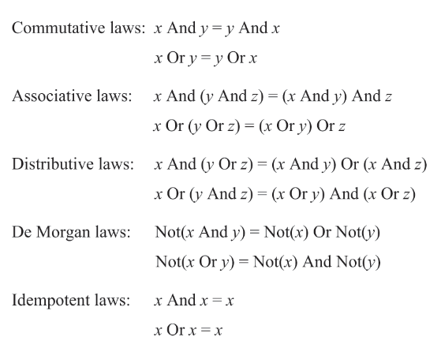

# Boolean Logic

### Boolean Algebra




### Nand (primitive)

```python
# output false when inputs are all true
def Nand(x, y):
    out = negate(x and y)
    return out
```

### Not

```python
def Not(in):
    out = Nand(in, in)
    return out
```

### And

```python
def And(x, y):
    z = Nand(x, y)
    out = Not(z)
    return out
```

### Or

```python
def Or(x, y):
    x = Not(x)
    y = Not(y)
    out = Nand(x, y)
    return out
```

### Xor


```python
# (~(x & y) & x) || (~(x & y) & y)
# => ((~x || ~y) & x) || ((~x || ~y) & y)
# => ((x & ~x) || (x & ~y)) || ((~x & y) || (y & ~y))
# => (x & ~y) || (~x & y)
def Xor(x, y):
    z = Nand(x, y)
    xx = Nand(x, z)
    yy = Nand(y, z)
    out = Nand(xx, yy)
    return out
```

### Mux

```python
def Mux(x, y, sel):
    return x if sel == 0 else y
```

### DMux

```python
def DMux(in, sel):
    return [in, 0] if sel == 0 else [0, in]
```

