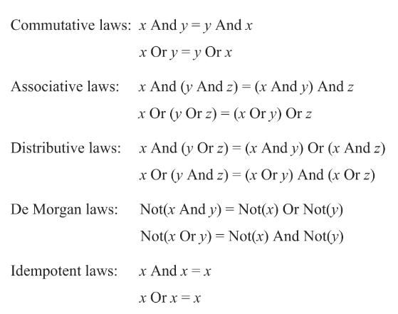

# Summary

### Boolean Algebra




### Nand (primitive)

```
// output false when inputs are all true
Nand(x, y):
	out = negate(x and y)
	return out
```

### Not

```
Not(in):
	out = Nand(in, in)
	return out
```

### And

```
And(x, y):
	z = Nand(x, y)
	out = Not(z)
	return out
```

### Or

```
Or(x, y):
	x = Not(x)
	y = Not(y)
	out = Nand(x, y)
	return out
```

### Xor


```
// (~(x & y) & x) || (~(x & y) & y)
// => ((~x || ~y) & x) || ((~x || ~y) & y)
// => ((x & ~x) || (x & ~y)) || ((~x & y) || (y & ~y))
// => (x & ~y) || (~x & y)
Xor(x, y):
	z = Nand(x, y)
	xx = Nand(x, z)
	yy = Nand(y, z)
	out = Nand(xx, yy)
	return out
```

### Mux

```
Mux(x, y, sel):
	return x if sel == 0 else y
```

### DMux

```
DMux(in, sel):
	return [in, 0] if sel == 0 else [0, in]
```

