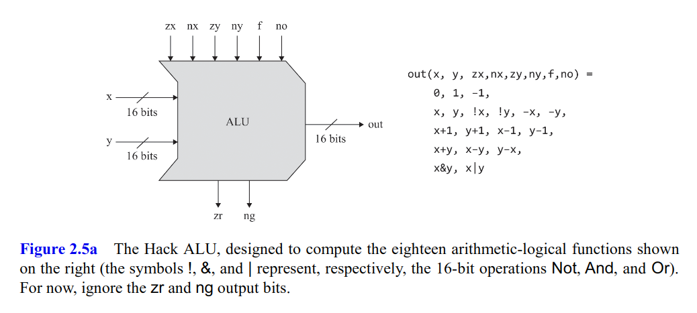
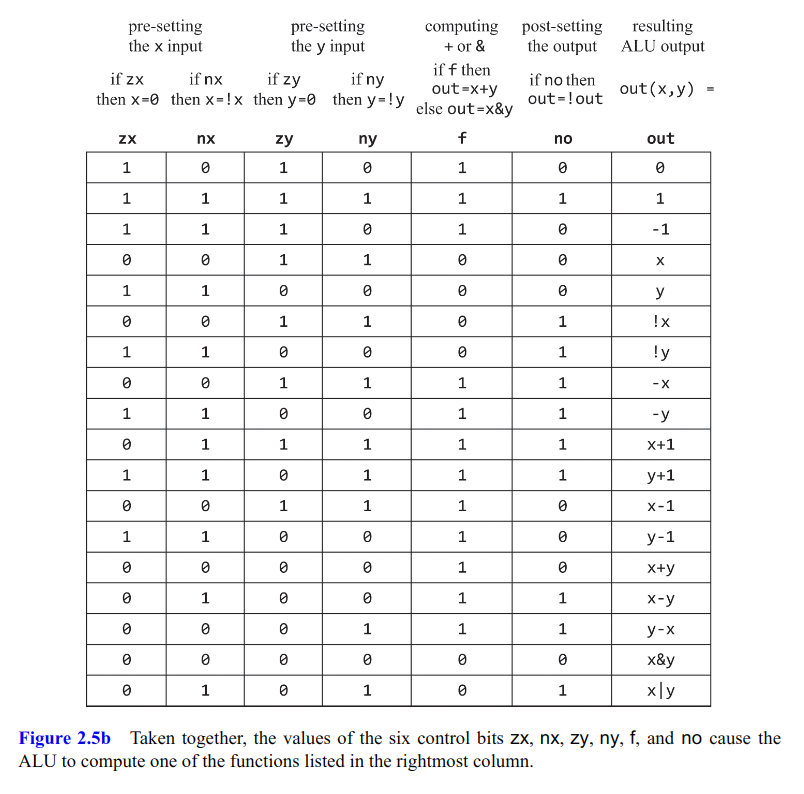

# Boolean Arithmetic

### HalfAdder

```python
def HalfAdder(a, b):
    sum = Xor(a, b)
    carry = And(a, b)
    return [sum, carry]
```

### FullAdder


```python
# First version, double HalfAdders and an Or gate
def FullAdder(a, b, c):
    [sum, c1] = HalfAdder(a, b)
    [sum, c2] = HalfAdder(sum, c)
    carry = Or(c1, c2)
    return [sum, carry]
	
# Second version, more efficient
# sum = a ^ b ^ c
# carry = (a & b) | (a ^ b & c) = Nand(Nand(a, b), Nand(a ^ b, c))
```

### Add16

```python
# implement with 15 FullAdders, and a HalfAdder at lsb
def Add16(a, b):
    sum = [None] * 16
    [sum[0], c] = HalfAdder(a[0], b[0])
    for i in range(1, 16):
        [sum[i], c] = FullAdder(a[i], b[i], c)
    return sum
```

### Inc16

```python
# implement with 16 HalfAdders
def Inc16(x):
    out = [None] * 16
    c = 1
    for i in range(0, 16):
        [out[i], c] = HalfAdder(x[i], c)
    return out
```

### ALU





```python
def ALU(x, y, zx, nx, zy, ny, f, no):
    if zx:
        x = 0
    if nx:
        x = ~x
    if zy:
        y = 0
    if ny:
        y = ~y
    out = (x + y) if f else (x & y)
    if no:
        out = ~out
    return out
```

