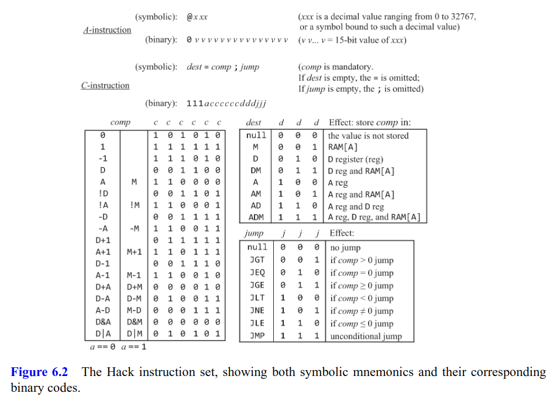
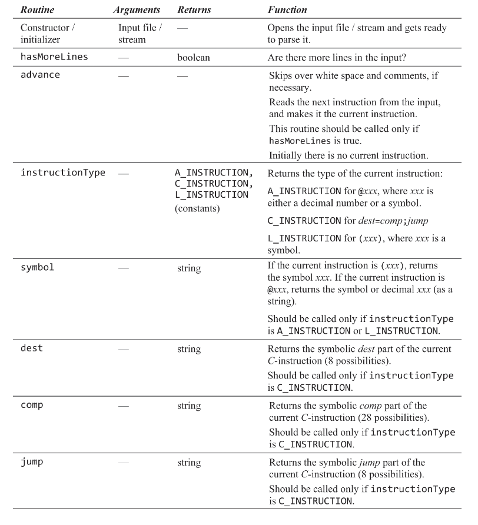
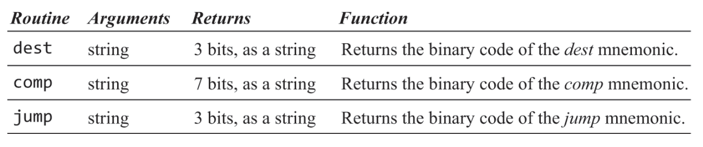

# Assembler

### Hack instruction set

### API

- Parser Module

  

- Code Module

  

- Hack Module

  This is the main program that drives the entire assembly process, using the services of the Parser and Code  modules

### Process

- Open the given assembly file as input stream, and also open the output stream (if doesn't exist, then create a .hack file)
- Initialize the symbol table with pre-defined labels
- Use Parser to scan the assembly file for collecting the jump labels into symbol table (value of jump label is the address of instruction which next to jump label)
- Start to translate
  - Call Parser to skip over spaces and comments, and read the next instruction
  - Make Parser to identify the type of instruction
  - If it is an address instruction, then return its symbol or constant value
    - If the symbol has existed in the symbol table, replace the symbol with its address value
    - If not, then the symbol is a new variable, allocate a new memory address for it, and update the symbol table with the symbol address. Also replace the symbol with its address value
  - If it is a computation instruction, then return its dest, comp and jump compenents. Pass these compenents to Code Mudule for decoding
  - Output the translation result